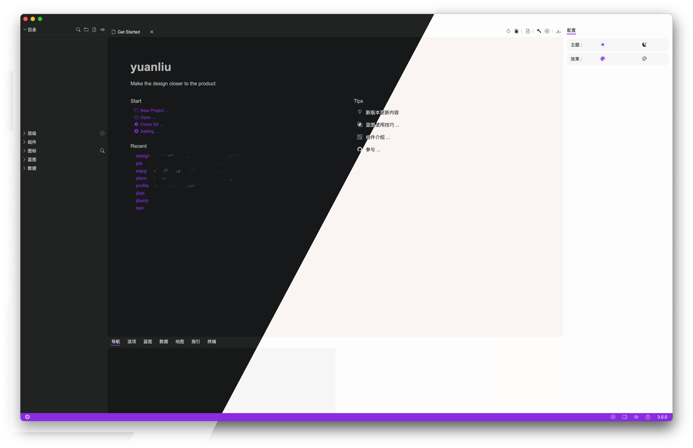
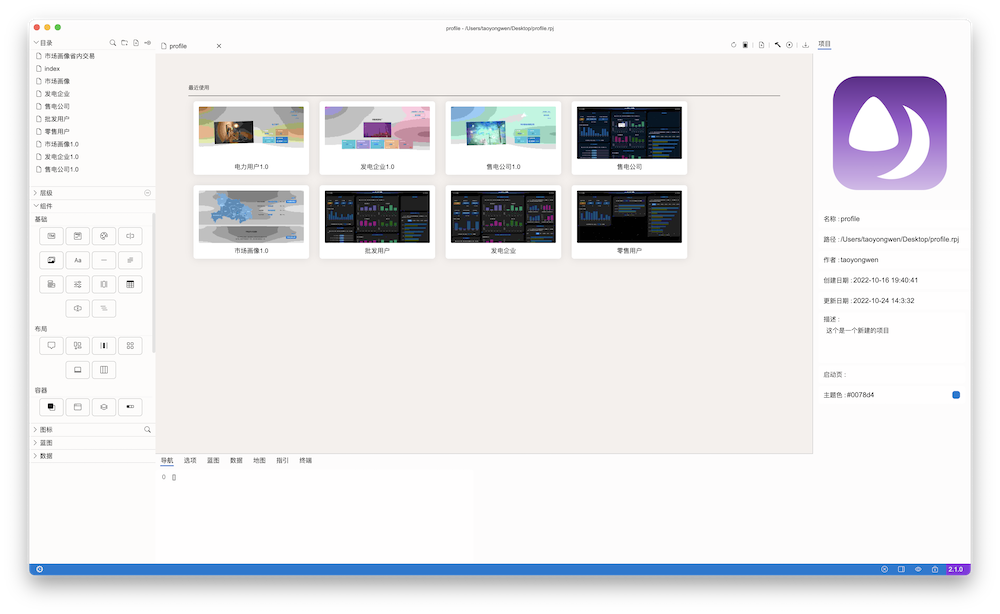
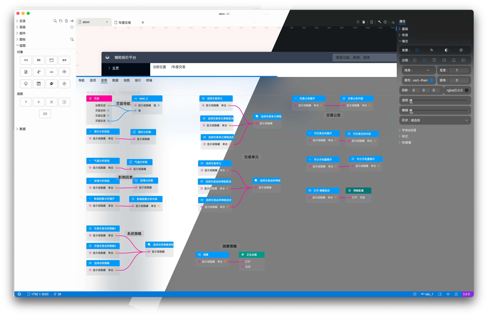
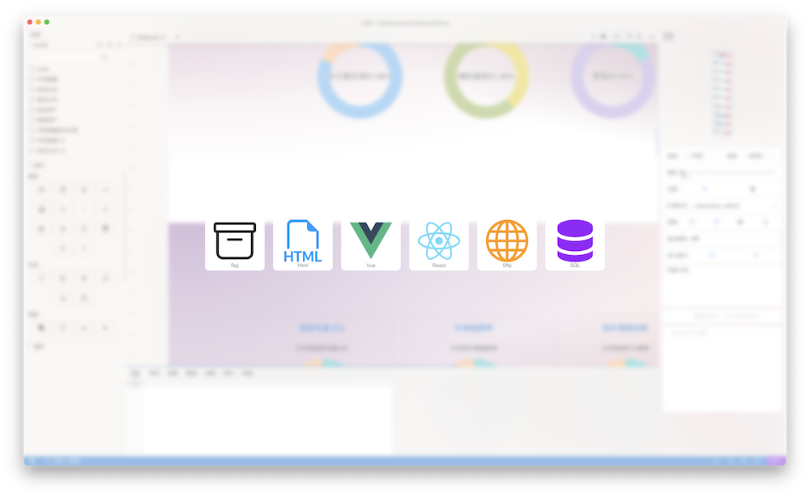

# 源流-设计即开发

## 介绍
    源流是一款开源跨平台的原型设计工具，目前以设计桌面原型为主。
    秉承“设计即开发”的宗旨，让设计更接近产品。
- 布局 - 更接近网页的flex布局。
- 多样图表 - 支持echarts库，实现丰富的图表，也可以手动绘制。
- 界面交互 - 使用蓝图工具，轻松实现界面交互逻辑。
- 数据操作 - 可以便捷设计数据库表、使用蓝图提供的增删改查操作，动态更新界面内容，无限接近设计产品初衷。
- 设计即开发 - 原型可导出为html演示版、vue版、react版和数据库备份。
- 团队协作 - 内置git、sftp工具，团队协同、实时发布轻松搞定。
- 丰富素材 - 可以共享自己的设计、或使用优秀的设计（待完善）。
### 起始页

### 主页面

### 蓝图页面

### 导出页面

## 版本更新

- [release 2.1.0](./releases//2.1.0/release%202.1.0.md) 

## 文档介绍

- [开始](./docs/started/Getting%20Started.md)
- [安装](./docs/setup/Setting%20up.md)
- [用户界面](./docs/guide/User%20guide.md)
- [组件](./docs/components/components.md)
- [蓝图](./docs/blueprint/blueprint.md)
- [演示&导出](./docs/build/build.md)

## 了解个更多

访问[violetime.com](https:www.//violetime.com/)

## License

[Apache-2.0 license](LICENSE.md)
